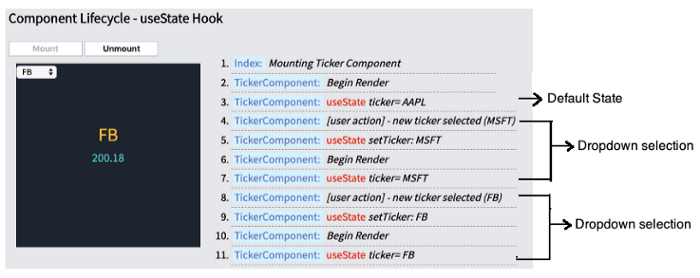
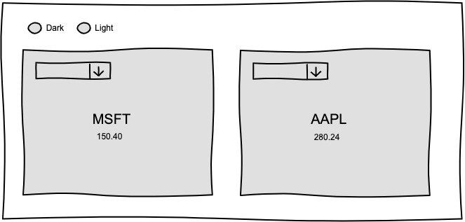
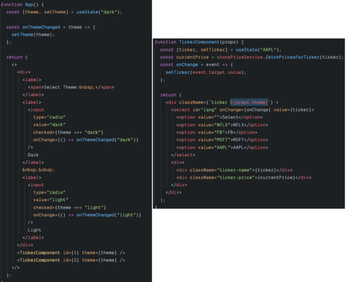
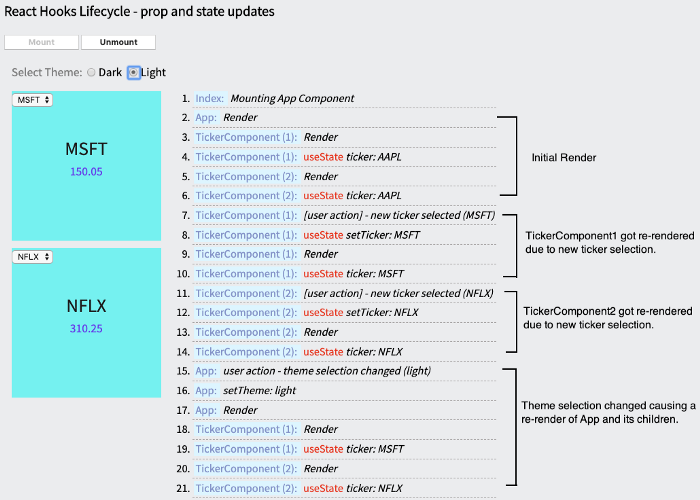
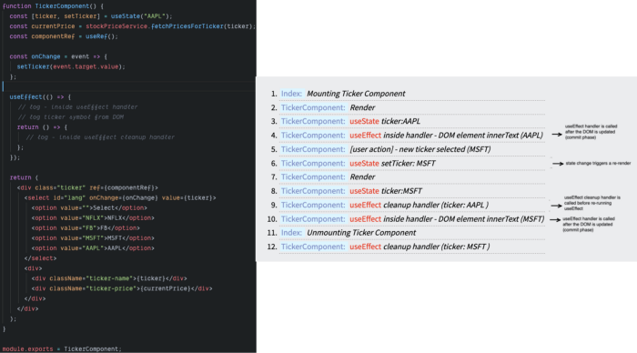

# React Hooks - 理解组件重新渲染

当我开始研究 React Hooks 时，官方文档对核心概念的解释非常好 - [hooks 背后的动机](https://reactjs.org/docs/hooks-intro.html#motivation)、[详细的 api 参考](https://reactjs.org/docs/hooks-reference.html)、[hook 的规则](https://reactjs.org/docs/hooks-rules.html)、[回答几个常见问题](https://reactjs.org/docs/hooks-faq.html)。但是一旦我开始使用它们，我就感觉到我对组件生命周期的理解存在差距。有时我无法解释为什么我的组件会被重新渲染（[似乎是一个常见问题](https://www.google.com/search?q=react+hooks+rerender+site:stackoverflow.com)），什么变化导致了无限的重新渲染循环（[另一个常见的循环](https://www.google.com/search?q=react+hooks+infinite+re-render+site%3Astackoverflow.com)），有时我不确定我是否使用了 useCallback/useMemo 实际上是在提高性能。

使用 hook 的功能组件将经历一个生命周期，但没有显式的生命周期方法，这与[基于类](https://twitter.com/dan_abramov/status/981712092611989509)的对应物不同。虽然这种非显式性质允许使用更少的样板代码将可重用行为提取到自定义 hook 中，但我发现自己缺乏对 hook 如何影响执行流程的清晰理解。

这篇文章是我探索每个内置钩子如何影响组件重新渲染/生命周期的结果。 我将通过详细的示例分享我的经验，并强调我遇到的一些陷阱。 这是一篇很长的文章，涵盖了大多数内置钩子，并附有大量截图和示例。 如果你只对特定的钩子感兴趣，请直接从下面的链接访问。

## 目录

- [术语](#术语)

- [useState](#useState)

- [useEffect](#useEffect)

- [useLayoutEffect](#useLayoutEffect)

- [useContext](#useContext)

- [useCallback](#usecallback--usememo)

- [useMemo](#usecallback--usememo)

- [useReducer](#useReducer)

### 术语

在高层次上，React 在转换组件树并将结果刷新到渲染环境时会经历三个阶段：

（来自 Kent C. Dodds 的这篇文章）：

- “渲染”阶段：创建 React 元素 _`React.createElement`_（[了解更多](https://kentcdodds.com/blog/what-is-jsx)）
- “ reconciliation ”阶段：将以前的元素与新元素进行比较（[了解更多](https://reactjs.org/docs/reconciliation.html)）
- “commit” 阶段：更新 DOM（如果需要）。

现在，是什么促使 React 触发渲染阶段？ 这篇 [StackOverflow](https://stackoverflow.com/questions/55106951/react-with-hooks-when-do-re-renders-happen) 的帖子提供了一个简洁的答案。

- 组件接收新的 props。
- state 已更新。
- 更新上下文值（如果组件使用 useContext 监听上下文变化）。
- 由于上述任何原因，父组件会重新渲染。

这篇文章中每次提到“重新渲染”都是关于上面提到的“渲染阶段”。

#### 关于这篇文章中的例子：

- 我们将实现一个简单的股票报价器组件并围绕该组件添加功能以了解各种内置挂钩的行为。该组件显示股票代码及其价格。下拉菜单允许用户选择不同的代码。
  
- 所有示例都在组件旁边显示执行日志。每当 React 重新渲染组件时，组件周围会出现一个虚线边框（作为视觉线索）。
  
- 代码示例故意保持简单，主要关注执行流程（没有类型；没有后端调用；股票报价是模拟数据）。
- 当 React [发布并发模式](https://reactjs.org/docs/concurrent-mode-intro.html)时，某些示例中的行为可能会发生变化。

### useState

[useState](https://reactjs.org/docs/hooks-reference.html#usestate) hook 是主要的构建块，它使功能组件能够在重新渲染之间保持状态。

让我们通过一个例子来了解 useState 的工作原理。 我们将按照上面的草图实现 Ticker 组件。UI 上显示的活动代码使用 useState 挂钩存储在本地状态中。 这是组件的相关部分（[此处为完整代码](https://codesandbox.io/s/01a-usestate-single-61yn2)）。

```js
const [ticker, setTicker] = useState("AAPL");
...
const onChange = event => {
   setTicker(event.target.value);
}
...
```

让我们详细了解一下这段代码：

- useState 语句返回一个状态值（'ticker'）和一个 setter 函数来更新相应的状态值（'setTicker'）。
- 当组件第一次呈现时，“ticker” 值将是参数中指定的默认值（即“AAPL”）。
- 当从下拉列表中选择新代码时，将调用 onChange 函数。此函数使用 setter 函数更新 state。**此 state 更改会触发重新渲染**——调用 TickerComponent 函数再次执行。但这一次“useState(‘AAPL’)”返回了先前由 setter 函数设置的代码值。这几乎就像 React 将 state 存储在与我们组件实例相关的隐藏数据存储中。最新的状态值被保存并在重新渲染时返回。如果组件被卸载并重新安装，那么一切都会重新开始。

所有上述步骤都在下面的屏幕截图中可视化。安装后，Ticker 组件将使用默认代码（“AAPL”）呈现。下拉列表中的新代码选择会更新触发重新渲染的代码状态。请注意在代码选择之后突出显示的边框。执行日志将此步骤显示为“开始渲染”。

这是日志的快照：

该动画从代码的上下文中说明了组件的行为（步骤 1-12）。


#### 父组件中状态更新的影响

我们已经看到由于功能组件内的本地状态更改而导致组件重新渲染周期。会发生什么——当父组件和子组件拥有自己的本地状态（通过 useState）并且父组件的状态发生变化时？

让我们扩展 TickerComponent 以支持“主题” props。它的父组件（“App”）将主题值保存在一个状态中，并通过 props 将其传递给子组件。

（注意：在实际应用中，useContext 钩子更适合支持主题等功能，而不是通过组件树作为 props 向下传递值）

App 组件在其状态中包含“主题”变量，并有两个 Ticker 组件作为子组件。主题作为 props 传递给 TickerComponents。TickerComponent 使用 props.theme 并将值呈现为 css 类（这是对上一个示例中 TickerComponent 的唯一更改）。




让我们解析执行日志 --：

- 第 1 组：当 App 组件被挂载时，它被初始化为默认的“dark”主题，ticker 组件被初始化为默认的“AAPL”ticker。
- 第 2/3 组：在 Ticker 组件中都选择了新的代码，并且状态更改触发了本地重新渲染（如前面的示例）
- 第 4 组：现在在父组件中更改了主题值，父组件（App）和它的子组件（ticker 组件）都被重新渲染。

当 App 组件重新渲染时，其子组件将重新渲染，而不管它们是否使用主题值（作为 prop ）。查看这个[更新的示例](https://codesandbox.io/s/01c-usetstate-child-no-theme-dependency-3ig0z)，其中第二个代码组件不使用主题状态，而是在主题更改时重新呈现。这是 React 的默认行为，可以通过使用 [useMemo](https://medium.com/@guptagaruda/react-hooks-understanding-component-re-renders-9708ddee9928#204b) 钩子包装子组件来改变它，我们稍后会研究它。

#### 补充说明：

- 当使用某个 prop 值作为默认值（下面的片段）初始化状态变量时，prop 值仅在第一次创建状态时使用。对 prop 的任何进一步更新都不会自动“同步”组件的本地状态。这样的假设将导致错误的行为，请查看 Dan 关于该主题的出色文章，[以及 React 文档中的这篇文章](https://reactjs.org/blog/2018/06/07/you-probably-dont-need-derived-state.html)，以详细解释这种反模式和可能的解决方案。

```js
const [localState, setLocalState] = useState(props.theme);
```

- 当 setState 处理程序被多次调用时，React 会批处理这些调用，并且当调用代码位于基于 React 的事件处理程序中时，只会触发一次重新渲染。如果这些调用是从非基于 React 的处理程序（如 setTimeout）发出的，则每次调用都会触发重新渲染。 （请参阅有关此主题的[这篇文章](https://github.com/facebook/react/issues/14259#issuecomment-439632622)）

### useEffect

_[来自文档](https://reactjs.org/docs/hooks-reference.html#useeffect) - 函数组件的主体内不允许突变、订阅、计时器、日志记录和其他副作用（称为 React 的渲染阶段）。这样做会导致 UI 中出现令人困惑的错误和不一致。_

_相反，使用 `useEffect`。传递给 `useEffect` 的函数将在渲染提交到屏幕后运行。将效果视为从 React 的纯函数式世界到命令式世界的逃生口。_

_如果你熟悉 React 类的生命周期方法，你可以将 useEffect Hook 看作是 `componentDidMount`、`componentDidUpdate` 和 `componentWillUnmount` 的组合。_

让我们用几个例子来理解所有这些陈述。

在第一个示例中——我们将使用一些日志语句简单地将 useEffect 处理程序添加到 TickerComponent。 目标是了解此函数何时在组件生命周期中执行。

```js
useEffect(() => {
  // logs 'useEffect inside handlers
  // logs the active ticker currently shown (by querying the DOM)
  return () => {
    // logs 'useEffect cleanup handler'
  };
});
```

下面是简化的代码（[完整版在这里](https://codesandbox.io/s/02a-useeffect-basic-tjy8o)）。执行日志是三个操作的结果：

- 挂载组件
- 将代码更改为“MSFT”
- 卸载组件
  

让我们仔细查看执行日志以了解发生了什么 -

#1, 2, 3：在安装时，组件使用默认代码 (‘AAPL’) 呈现。
#4: useEffect 处理程序在挂载后第一次运行 — **DOM 元素已经有了默认状态（‘AAPL’）。这意味着当 useEffect 处理程序运行时，React 完成了将组件状态同步到 DOM。**注意：清理处理程序尚未运行（因为之前没有运行 useEffect 处理程序调用）。
#5：从下拉列表中选择新代码（到“MSFT”）。
#6、7、8：状态改变。 使用新状态 (‘MSFT’) 重新渲染的组件。
#9：**从之前的 useEffect 调用返回的清理处理程序现在运行（注意：这里的代码值是“AAPL”，因为这个闭包是从之前的 useEffect 运行中创建并返回的）。**
#10：useEffect 处理程序再次运行，就像 DOM 已经有了新的代码状态（“MSFT”）之前一样。
#11, 12: 最后，当组件被卸载时，React 确保运行与最后一个效果相关的清理处理程序（对于代码‘MSFT’）。

我们从这个例子中学到了两件事：

- React 在将当前组件状态完全同步到 DOM 后运行 useEffect 处理程序。这使它成为启动副作用（后端调用、注册订阅、日志记录、计时器等）的理想场所。
- useEffect 处理程序（清理处理程序）返回的函数在 useEffect 处理程序下一次运行之前（或卸载之后）运行。这是进行与副作用相关的清理操作（取消订阅/分离事件处理程序等）的理想场所。这对于避免内存泄漏也很重要。由于“清理”处理程序是一个闭包，它会捕获函数创建和返回时的状态，即使该函数在下一次重新渲染中执行，事情也会自然而然地工作（从日志中检查步骤 #9 和 #12 — 清理处理程序中的状态值来自较早的迭代）。

让我们将所有这些概念与一个具体的例子联系起来。 我们希望更新代码组件，使其不断刷新活动代码的最新报价。我们将使用（模拟）流式股票报价服务。 该 API 允许为每几秒调用一次当前报价的代码注册回调。它返回一个清理处理程序，当调用 API 时停止执行代码的回调。

下面是精简的代码片段（[完整版](https://codesandbox.io/s/02c-useeffect-service-lvgnb)在这里）。每个价格变化通知都会在价格上执行一个 setState，从而触发重新渲染。当活动代码更改时，您可以看到清理处理程序针对前一个代码运行。

 

让我简要回顾一下 useEffect 调用中的依赖数组（第二个参数）。当省略此参数时，React 将在每次重新渲染后执行 useEffect 处理程序（如 useEffect 中的第一个示例）。大多数时候这将是低效的。指定依赖项后，React 将仅在该列表中的任何依赖项发生更改时运行 useEffect 处理程序。

大多数情况下，无限重新渲染是未正确配置依赖项列表的结果。 例如 如果您将函数引用添加为依赖项，并且如果每次重新渲染时引用都会发生变化（重新创建函数），那么 useEffect 会在每次重新渲染时运行，并且此处理程序中的状态更改会导致重新渲染并且循环重复 导致无限渲染循环。


[https://codesandbox.io/s/02c-useeffect-service-lvgnb](https://codesandbox.io/s/02c-useeffect-service-lvgnb)

快照中需要注意的一些有趣的事情：

- #4，#16：useEffect 处理程序（用于注册价格更新）仅在代码状态更改时运行。 由于依赖列表，useEffect（和清理）处理程序没有在每次重新渲染时运行。
- 每个价格变化通知（#5、#8、#17、#20）都会触发重新渲染，就像股票代码变化事件（#11、#12）一样。 这两个处理程序都使用 useState 更新相应的状态值。
- 默认代码“AAPL”的清理处理程序在 useEffect 处理程序为新的代码状态“MSFT”（＃16）运行之前运行（＃15）。

其他参考：

- 查看 Dan 的“[Don't Stop the Data Flow in Side Effects](https://overreacted.io/writing-resilient-components/#dont-stop-the-data-flow-in-side-effects)”帖子，欣赏 useEffect 钩子的优雅。

### useLayoutEffect

有时我们想要应用的副作用是直接使用 DOM 操作（基于渲染布局的 css 更新、拖放等）。在这种情况下，“useLayoutEffect”处理程序是进行这些突变的理想场所。

_[来自文档](https://reactjs.org/docs/hooks-reference.html#uselayouteffect) - 签名与 useEffect 相同，但它会在所有 DOM 突变后同步触发。使用它从 DOM 中读取布局并同步重新渲染。在 useLayoutEffect 中安排的更新将在浏览器有机会绘制之前同步刷新。_

让我们通过一个定制的例子来看看它的含义。这次我们想构建一个报价组件——它有一个按钮来获取随机报价和一个显示表面来呈现该报价。无论报价的大小如何，我们都希望将显示表面保持在固定高度。当检索到更长的引用时，应剪切内容并出现“扩展完整引用”链接。这是此设置的草图-

在使用 useLayoutEffect 处理程序之前，让我们继续使用已知的 useEffect 处理程序，看看为什么它在这种情况下不起作用。 下面是在渲染长引号时剪辑容器的精简代码片段——它检查容器高度并在原始高度超过阈值时添加一个“固定高度”css 类。 此代码在 useEffect 挂钩处理程序中运行。 当显示长引用时，右侧的屏幕截图显示类似闪烁的行为。

[https://codesandbox.io/s/03a-blink-with-useeffect-e68yi](https://codesandbox.io/s/03a-blink-with-useeffect-e68yi)

Chrome 性能分析器揭示了为什么会发生这种情况（下面的屏幕截图）-

- 当长引用被设置为状态时，React 将完整的引用提交给 DOM。
- 浏览器进行布局计算并在屏幕上绘制完整的报价（参考标签“浏览器在此处绘制完整的长报价”，绿色块表示绘制操作）。
- useEffect 处理程序现在运行。 我们可以根据我们在代码中添加的自定义性能标记（“use_effect_handler_end”）来发现它的执行情况。 此标记在第一次绘制后出现。
- 在 useEffect 处理程序中，已在容器上添加了一个 css 类来裁剪高度。 此更改强制浏览器重新运行布局和绘制操作。 请参阅标签——“浏览器应用了溢出的 CSS 并重新绘制了屏幕”。
- 这两个油漆操作之间的（轻微）延迟导致了不和谐的体验。


[](https://codesandbox.io/s/03a-blink-with-useeffect-e68yi)

当“useEffect”被“useLayoutEffect”替换而没有其他更改时，这种行为就会消失（[完整代码在这里](https://codesandbox.io/s/03b-no-blink-with-uselayouteffect-nvsd0)）。这是更新的性能配置文件。“use_layout_effect_handler”标记的位置（在计时选项卡中）指示 useLayoutEffect 处理程序代码的执行。 它在提交状态之后立即同步运行，这导致了一个带有“剪辑”引用（我们理想的最终状态）的绘制操作。


[](https://codesandbox.io/s/03b-no-blink-with-uselayouteffect-nvsd0)

### useContext

[Context](https://reactjs.org/docs/context.html) 提供了一种通过组件树传递数据的方法，而无需在每个级别手动传递 props。

每当 Provider 的 value prop 发生变化时，[所有作为 Provider 后代的消费者都会重新渲染](https://reactjs.org/docs/context.html#contextprovider)。 从 Provider 到其后代消费者的传播不受 `shouldComponentUpdate` 方法的约束，因此即使祖先组件退出更新，消费者也会更新。

让我们通过例子来理解所有这些。如果您还记得我们之前使用 useState 所做的主题选择示例。让我们使用 Context 和 useContext 重写它，看看上下文更新如何触发重新渲染。


我们将对 UI 进行一次更改——我们将使其只有第一个 (Themed)TickerComponent 支持主题（暗/亮模式）。第二个 TickerComponent 始终以深色模式呈现。 这使我们能够看到对使用 useContext 的组件和不使用的组件的影响。

这是组件的层次结构及其代码片段，包括执行日志。


[https://codesandbox.io/s/04a-usecontext-uvmi0](https://codesandbox.io/s/04a-usecontext-uvmi0)


[https://codesandbox.io/s/04a-usecontext-uvmi0](https://codesandbox.io/s/04a-usecontext-uvmi0)

执行日志没有意外，当主题选择发生变化时，只有 ThemedTickerComponent 及其子 TickerComponent (1) 被重新渲染，因为它是 themeContext 的消费者。 TickerComponent2 没有日志。

```js
// ThemedTickerComponent
const { theme } = useContext(ThemeContext);
```

#### useContext 的低效消耗

让我稍微重新排列上面示例中的组件层次结构，以显示 useContext 的低效使用。 我删除了 ThemeSelector 组件，并将其所有代码移动到其父 (App) 组件中。

[https://codesandbox.io/s/04b-usecontext-bad-usage-m02xn](https://codesandbox.io/s/04b-usecontext-bad-usage-m02xn)

现在有了这个设置，每次主题更改都会重新渲染 App 组件及其所有子组件，无论他们是否使用了主题。 与上一个示例不同，TickerComponent(2) 在这种情况下也被重新渲染。

[https://codesandbox.io/s/04b-usecontext-bad-usage-m02xn](https://codesandbox.io/s/04b-usecontext-bad-usage-m02xn)

这是因为 App 组件现在成为了 useContext 的消费者。

如果上下文值更改过于频繁，并且树中某个较高位置的组件使用 useContext 将导致重新渲染其所有子级（除非它们被记忆）。 这种情况可能会导致性能瓶颈。 与往常一样，在优化之前测量性能影响。 React 开发工具分析器应该派上用场。

### useCallback & useMemo

[useCallback](https://reactjs.org/docs/hooks-reference.html#usecallback) — 返回一个 [memoized](https://en.wikipedia.org/wiki/Memoization) 回调。

传递一个内联回调和一组依赖项。`useCallback` 将返回回调的 memoized 版本，仅当其中一个依赖项发生更改时才会更改。 这在将回调传递给优化的子组件时很有用，这些子组件依赖于引用相等来防止不必要的渲染（例如 `shouldComponentUpdate`）。

[useMemo](https://reactjs.org/docs/hooks-reference.html#usememo) — 返回一个 [memoized](https://en.wikipedia.org/wiki/Memoization) 值。

传递一个“create”函数和一个依赖数组。 `useMemo` 只会在依赖项之一发生更改时重新计算记忆值。这种优化有助于避免在每次渲染时进行昂贵的计算。

在构建对性能敏感的组件时，这两个钩子都会派上用场。 我们将研究另一个量身定制的示例，以有效地了解这些钩子的用法。 我们将构建一个 Stocks Watchlist 组件，如下图所示。 我们应该构建这个组件，使得删除一个代码不应该重新渲染剩余的代码（在渲染大型项目列表时这是一个合理的期望）。


我按照我最初的思考过程，通过一系列增量步骤概述了解决方案。 它还强调了我们将遇到的一些陷阱。

#### step#1 — 从默认实现开始 — 不使用 useCallback/useMemo

监视列表组件的片段如下所示 -

- 此组件存储一个代码列表（处于状态）并定义一个 onRemove 处理程序，该处理程序通过删除作为参数发送的代码来更新状态。
- 它通过将 ticker 值和 onRemove 处理程序作为 props 为列表中的每个 ticker 呈现 TickerComponent。

如屏幕截图所示，每次删除一个代码时，所有其他代码都会重新渲染。 当一个代码被删除时，监视列表状态会更新，强制监视列表组件的子组件重新渲染。 我们在前面的 useState 示例中已经看到了这种默认行为。
 
[https://codesandbox.io/s/06a-usecallback-attempt1-xffbh](https://codesandbox.io/s/06a-usecallback-attempt1-xffbh)

#### step#2 — 利用 useMemo 和 useCallback

我们不希望 TickerComponent 每次重新渲染它的父级时都重新渲染，除非依赖关系发生了变化。 useMemo 钩子提供了我们正在寻找的记忆功能。

[https://codesandbox.io/s/06b-usecallback-usememo-ngwev](https://codesandbox.io/s/06b-usecallback-usememo-ngwev)

此代码片段显示了利用 useMemo 挂钩的记忆化 TickerComponent。 React 跳过重新渲染组件并返回先前缓存的结果，除非列出的依赖项之一发生更改（ticker，onRemove 处理程序）。

接下来，我们需要优化“onRemove”属性。 它在监视列表组件中被定义为一个匿名函数，每当监视列表组件重新呈现时，它都会重新创建。 由于每次重新渲染时它的引用都会发生变化，因此它只是取消了我们在上面所做的 TickerComponent 记忆。

```js
const onRemove = (tickerToRemove) => {
  setWatchlist(watchlist.filter((ticker) => ticker !== tickerToRemove));
};
```


[https://codesandbox.io/s/06b-usecallback-usememo-ngwev](https://codesandbox.io/s/06b-usecallback-usememo-ngwev)

我们不希望每次重新渲染都有新的函数引用。 useCallback 钩子是我们正在寻找的。 它接受一个函数并返回一个记忆函数，其引用在重新渲染之间不会改变，除非它的依赖项之一发生变化。 让我们用 useCallback 包装 onRemove 处理程序。

这是进行两项更改后的日志。 有趣的是，当一个代码被移除时，这两个变化并没有停止重新渲染现有的代码组件。 您可以从现有的股票代码组件中看到“开始渲染”。


[https://codesandbox.io/s/06b-usecallback-usememo-ngwev](https://codesandbox.io/s/06b-usecallback-usememo-ngwev)

#### 最后一步——使用 setState 的函数形式

如果您仔细查看 useCallback 包装的 onRemove 处理程序，则会将监视列表添加到依赖项数组中，因为该函数会更新监视列表。 事实证明，这是重新渲染的原因。

[https://miro.medium.com/max/700/1\*1o9vOmwwzi4Qv10Bpl-pMg.png](https://miro.medium.com/max/700/1*1o9vOmwwzi4Qv10Bpl-pMg.png)

每当删除代码时：

- 过滤掉已删除的代码后，监视列表状态将使用新的数组引用进行更新。
- 在下一次重新渲染中，useCallback 返回一个新的 onRemove 处理程序引用，因为它的依赖项（监视列表）已更改。
- 新的 onRemove 处理程序引用将使 TickerComponents 的记忆无效。

我们回到了与默认实现相同的问题，但现在所有记忆化（!!!）的内存占用更多

为了实现我们需要的功能，即使监视列表数组发生变化，onRemove 函数引用也不应该发生变化。我们需要以某种方式创建这个函数一次并记住它，而不需要监视列表作为依赖项。

值得庆幸的是，[来自 useState 钩子的 setter 函数支持一个功能变体](https://github.com/facebook/react/issues/14099)，它可以帮助我们。 我们可以发送一个获取当前状态作为参数的函数，而不是使用更新的监视列表数组调用 setWatchlist。 这是 onRemove 处理程序的修改版本，不依赖于监视列表数组。 内部函数获取当前监视列表（状态）作为参数，它过滤掉要删除的代码并返回更新的监视列表数组。 监视列表状态使用返回的值进行更新。


[https://codesandbox.io/s/06c-usecallback-final-no-rerenders-bsm64](https://codesandbox.io/s/06c-usecallback-final-no-rerenders-bsm64)

这带来了我们正在寻找的所需优化。 现在删除一个代码不会重新渲染现有的代码组件（代码组件周围没有闪烁的边框）。


[https://codesandbox.io/s/06c-usecallback-final-no-rerenders-bsm64](https://codesandbox.io/s/06c-usecallback-final-no-rerenders-bsm64)

您可能已经注意到，很容易在代码库中添加 useCallback 和 useMemo 钩子，而没有预期的性能优势。 有效地添加它们需要彻底了解组件层次结构以及衡量性能增益的正确方法。

请务必查看 Kent C. Dodds 的这篇出色的帖子，该帖子彻底涵盖了该主题。 https://kentcdodds.com/blog/usememo-and-usecallback

### useReducer

_[来自官方文档](http://an%20alternative%20to%20usestate.%20accepts%20a%20reducer%20of%20type%20%28state%2C%20action%29%20%3D%3E%20newstate%2C%20and%20returns%20the%20current%20state%20paired%20with%20a%20dispatch%20method.xn--%20%28if%20youre%20familiar%20with%20redux%2C%20you%20already%20know%20how%20this%20works-yk80d.%29%20%20usereducer%20is%20usually%20preferable%20to%20usestate%20when%20you%20have%20complex%20state%20logic%20that%20involves%20multiple%20sub-values%20or%20when%20the%20next%20state%20depends%20on%20the%20previous%20one.%20usereducer%20also%20lets%20you%20optimize%20performance%20for%20components%20that%20trigger%20deep%20updates%20because%20you%20can%20pass%20dispatch%20down%20instead%20of%20callbacks./)，[useState](https://reactjs.org/docs/hooks-reference.html#usestate) 的替代方案。 接受类型为 `(state, action) => newState` 的 reducer，并返回与 dispatch 方法配对的当前状态。 （如果你熟悉 Redux，你已经知道它是如何工作的。）_

上面示例中的监视列表组件已修改为使用 useReducer。 这种方法使事情变得更加简单，并且不会遇到我们在前面的示例中使用 useCallback 时遇到的状态失效问题。

 
[https://codesandbox.io/s/07-usereducer-5l0tk](https://codesandbox.io/s/07-usereducer-5l0tk)

 [https://codesandbox.io/s/07-usereducer-5l0tk](https://codesandbox.io/s/07-usereducer-5l0tk)

这些例子澄清了我关于执行流程/重新渲染的很多问题。 他们还帮助创建了一个更好的思维模型，围绕更有效地使用钩子构建功能组件。

感谢您抽出宝贵时间阅读本文。 我希望你觉得这篇文章有用。 如果您有任何反馈，请在评论中告诉我。
