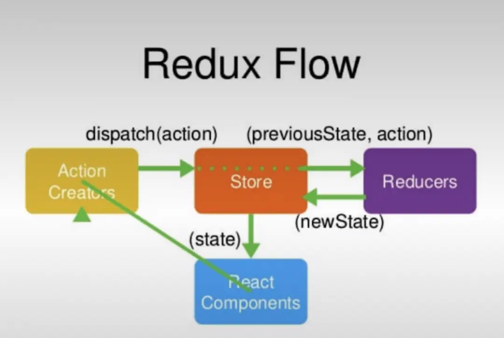

## Redux 基础知识

> JavaScript 应用的状态容器，为了状态统一管理，在 react 中将所需状态进行顶层集中管理。

### 三大原则

> 单一数据源、state 只读、使用纯函数执行修改

### 数据流

- `store`:

  UI 唯一数据源，类似于 react 中的`state`,store 信息变化会触发视图更新

- `action`:

  对象。必须拥有 type 属性,用来描述发生什么。可选择携带发生时的数据，如用户输入的 input value。切记：仅仅用来表述发生了什么。

  ```js
  {
    type: 'TOOL', // 必须，为字符串
    index: 3 // 自定义
  }
  ```

  也可使用 action 生成器，也就是使用方法返回一个 action 对象（必须包含 type 的对象）

- `reducer`:

  纯函数（pure function）。根据 action.type 来做出反应，(preState, action) => newState，生成的 state 是用来改变 store 的。

- 数据流（data flow）：

  1. UI 事件传出，如 click, submit;
  2. action, 描述发生了什么;
  3. reducer 处理发生的事情，生成新 state;
  4. store 被更新；
  5. UI 响应 store 更新

  

### Hooks

- `useSelector`:
  读取数据
- `useDispatch`:
  触发改变 state 的动作函数 reducer

## redux-toolkit 使用
